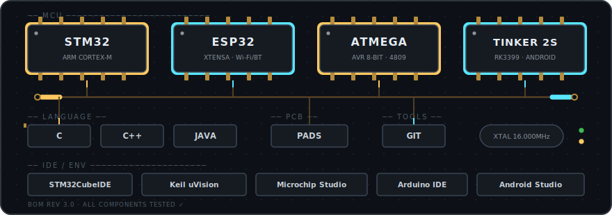
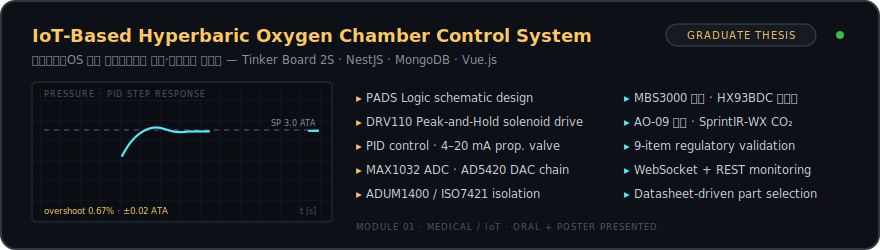
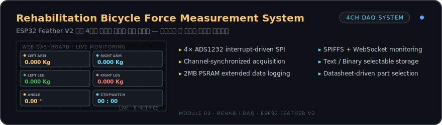
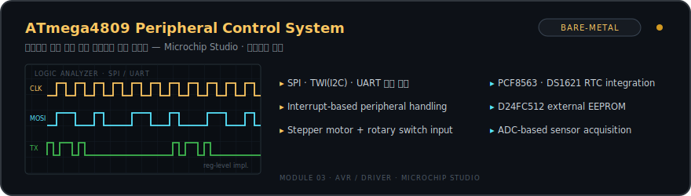
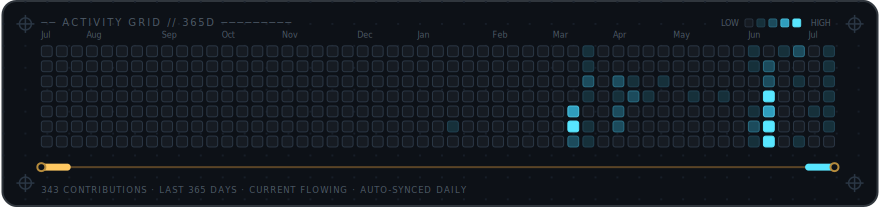

  

&nbsp;🏥 <b>세부 스펙 보기 — HBOT Chamber Control System</b>

> Graduate Thesis · 사물인터넷(IoT) 기술을 활용한 안드로이드OS 기반 고압산소챔버 제어 및 모니터링 시스템 개발에 관한 연구
> *Development of an Android OS-Based Control and Monitoring System for Hyperbaric Oxygen Chambers Using Internet of Things (IoT) Technology*

- Schematic design using PADS Logic
- Component selection based on datasheet review (sensors & valve)
- Solenoid driver (DRV110) with Peak-and-Hold PWM — 소비전력 66% 감소
- PID control (4–20 mA proportional valve)
- SPI ADC (MAX1032), DAC Daisy Chain (AD5420)
- Digital isolators (ADUM1400 / ADUM1200 / ISO7421)
- Sensors:
  - MBS3000 · 압력 센서 (4–20 mA)
  - HX93BDC · 온습도 센서 (4–20 mA)
  - AO-09 · 산소 농도 센서 (9–13 mV)
  - SprintIR-WX-100 · CO₂ 농도 센서 (UART)
- WebSocket + REST API-based IoT monitoring

&nbsp;🚲 <b>세부 스펙 보기 — Rehabilitation Bicycle Force Measurement</b>

> ESP32 Feather V2 기반 4채널 로드셀 동기화 수집 시스템

- 4× ADS1232 interrupt-driven SPI
- Synchronized acquisition across channels
- 2MB PSRAM for extended data logging
- WebSocket-based monitoring using SPIFFS
- Text / Binary selectable storage
- Component selection based on datasheet review

&nbsp;⚙️ <b>세부 스펙 보기 — ATmega4809 Peripheral Control</b>

> ATmega4809 기반 제어 시스템 · Microchip Studio

- Direct implementation of SPI, TWI(I2C), and UART
- Interrupt-based peripheral handling
- Stepper motor control and rotary switch input processing
- RTC (PCF8563 · DS1621) integration
- External EEPROM (D24FC512) interfacing
- ADC-based analog sensor acquisition

  

